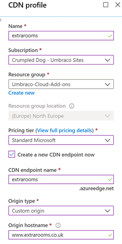
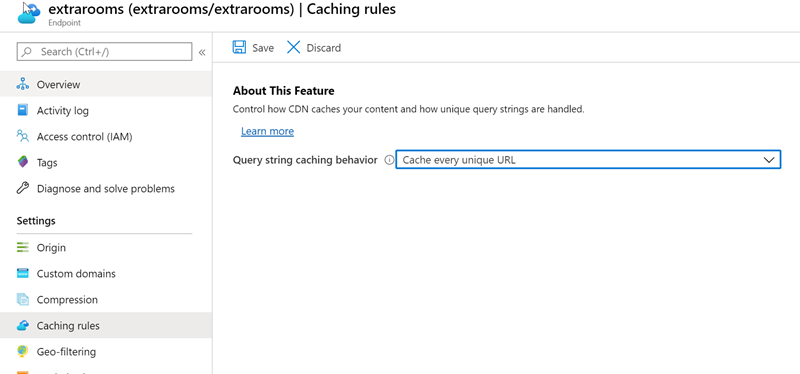
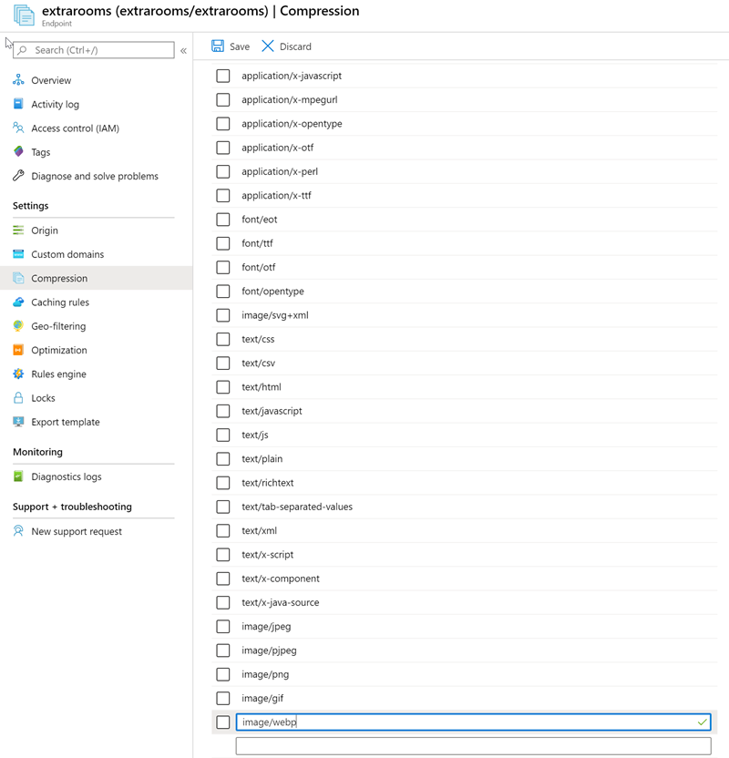

# Slimsy v3 with Azure CDN
============

## Step 1 - Create a Azure CDN + Endpoint

Either use a custom orgin and set the domain of your website (the example is a Umbraco Cloud site) or select a WebApp



## Step 2 - Set caching rules

Set Caching Rules to "Cache every unique URL"



## Step 3 - Add Mime types

Add the following types

- image/jpeg
- image/pjpeg
- image/png
- image/gif
- image/webp



## Step 4 - Set DomainPrefix in web.config

```xml
<add key="Slimsy:DomainPrefix" value="https://extrarooms.azureedge.net" />
```

## Step 5 - Update GetCropurl 

If you would also like any GetCropUrl methods to return via the CDN then you need to update your code

e.g.

```csharp

```

change to:

```csharp

 ```